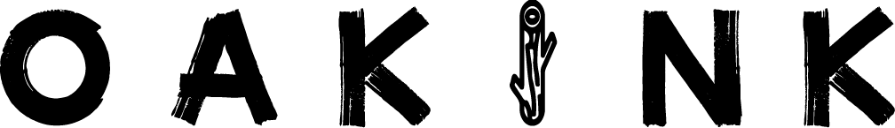

 

  

    
  

<h1 align="center">A Large-scale Knowledge Repository for Understanding Hand-Object Interaction </h1>

  

    CVPR, 2022
     
    <a href="https://lixiny.github.io"><strong>Lixin Yang</strong></a>
    ·
    <a href="https://kailinli.top"><strong>Kailin Li</strong></a>
    ·
    <a href=""><strong>Xinyu Zhan</strong></a>
    ·
    <a href=""><strong>Fei Wu</strong></a>
    ·
    <a href="https://anran-xu.github.io"><strong>Anran Xu</strong></a>
    .
    <a href="https://liuliu66.github.io"><strong>Liu Liu</strong></a>
    ·
    <a href="https://mvig.sjtu.edu.cn"><strong>Cewu Lu</strong></a>
  

  

    
    <!-- <a href='#' style='padding-left: 0.5rem;'>
      
     -->
  

 

The datasets and toolkit will be publicly available upon the main conference.

