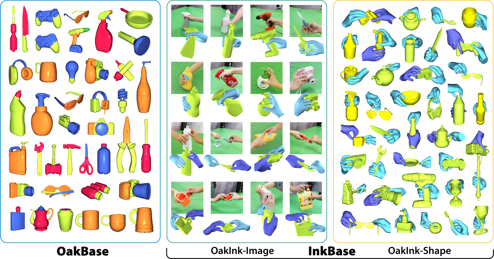

<br />
<p align="center">
  <p align="center">
    
  </p>
  <h2 align="center">A Large-scale Knowledge Repository for Understanding Hand-Object Interaction </h2>
  <h3 align="center"> :nut_and_bolt: Dataset Toolkit </h3>

  <p align="center">
    <a href="https://lixiny.github.io"><strong>Lixin Yang*</strong></a>
    ·
    <a href="https://kailinli.top"><strong>Kailin Li*</strong></a>
    ·
    <a href=""><strong>Xinyu Zhan*</strong></a>
    ·
    <strong>Fei Wu</strong>
    ·
    <a href="https://anran-xu.github.io"><strong>Anran Xu</strong></a>
    .
    <a href="https://liuliu66.github.io"><strong>Liu Liu</strong></a>
    ·
    <a href="https://mvig.sjtu.edu.cn"><strong>Cewu Lu</strong></a>
  </p>
  <h3 align="center">CVPR 2022</h3>

  <div align="center">
    
  </div>
  <br/>

  <p align="center">
    <a href="https://arxiv.org/abs/2203.15709">
      </a>
    <a href='https://oakink.net'>
      </a>
    <a href="https://www.youtube.com/watch?v=vNTdeXlLdU8"></a>
  </p>
</p>


This repo contains the **OakInk data toolkit (oikit)** -- a Python package that provides data 
loading, splitting, and visualization tools for the OakInk knowledge repository.   

OakInk contains three parts:
* **OakBase:** Object Affordance Knowledge (Oak) base, including objects' part-level segmentation and attributes.
* **OakInk-Image:** a video dataset with 3D hand-object pose and shape annotations.
* **OakInk-Shape:** a 3D grasping pose dataset with hand and object mesh models.


### Summary on OakInk

- It contains 3D models, part segmentation, and affordance labels of 1,800 common household objects.
- It records human grasps with 100 (from 1,800) objects based on their affordances.
  - It contains 792 multi-view video clips (230K images) complemented with annotation.
  - Images are from four third-person views.
  - It contains dynamic grasping and handover motions.
  - It includes 3D ground-truth for MANO and objects.
- It contains a total of 50k hand-object interaction pose pairs involving the 1,800 objects.
  - 1k are from the recording, 49K are done via interaction transfer. 


### Why use OakInk:
- For studying hand-object pose estimation and hand-held object reconstruction. 
- For generating grasping pose, motion or handover with objects. 
- For generating affordance-aware pose or motion for object manipulation.
- For transferring hand pose or motion to a new object.


### Getting Started
Clone the repo 
  ```bash
  $ git clone https://github.com/lixiny/OakInk.git
  ```
- Install environment: see [`docs/install.md`](docs/install.md)  
- Get datasets: see [`docs/datasets.md`](docs/datasets.md)

### Load and Visualize
```bash
# visualize OakInk-Image mesh on sequence level:
#   * --draw_mode [mesh, wireframe] to switch between mesh and wireframe
#   * --seq_id: select sequence id from OAKINK_DIR/image/anno/seq_status.json to visualize
#   * --view_id: select from [0, 1, 2, 3] for visualize from different views.
python scripts/viz_oakink_image_seq.py --draw_mode mesh --view_id 1

# use OakInkImage to load data_split: train, mode: subject (SP1) and visualize:
#   * --data_split: select from [train, val, test, all]
#   * --mode_split: select from [default, object, subject, handobject]
python scripts/viz_oakink_image.py --data_split train --mode_split subject

# use OakInkShape to load object category: teapot and intent: use:
#   * --categories: select from OAKINK_DIR/shape/metaV2/yodaobject_cat.json, or "all"
#   * --intent_mode: select from [use, hold, liftup, handover] or "all"
#   * --data_split: select from [train, val, test, all]
python scripts/viz_oakink_shape.py --categories teapot --intent_mode use
# press `N` to load next sample

# use OakInkShape to load all the training grasps
python scripts/viz_oakink_shape.py --categories all --data_split train

# use OakInkShape to load all the training grasps in handover
python scripts/viz_oakink_shape.py --categories all --data_split train --intent_mode handover
```

### Train and evaluate OakInk baselines
* [Hand Mesh Recovery](https://github.com/oakink/OakInk-HMR): recovery hand mesh from monocular image. 
* [Grasp Generation](https://github.com/oakink/OakInk-Grasp-Generation): generate human-like hand mesh grasping a given object.


### Citation

If you find OakInk dataset and **oikit** useful for your research, please considering cite us:
```bibtex
@inproceedings{YangCVPR2022OakInk,
  author    = {Yang, Lixin and Li, Kailin and Zhan, Xinyu and Wu, Fei and Xu, Anran and Liu, Liu and Lu, Cewu},
  title     = {{OakInk}: A Large-Scale Knowledge Repository for Understanding Hand-Object Interaction},
  booktitle = {IEEE/CVF Conference on Computer Vision and Pattern Recognition (CVPR)},
  year      = {2022},
}
```
