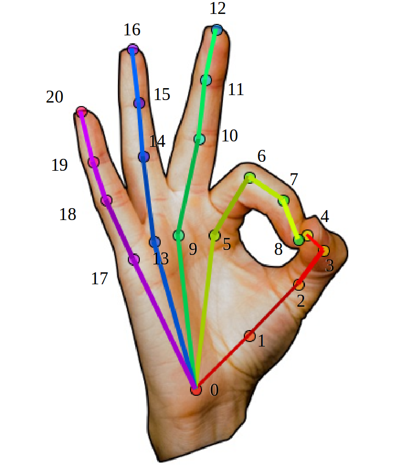

# OakInk Datasets

## Table of content

- [Download full OakInk](#download-full-oakink)
- [Data documentation](#data-documentation)
- [Data splitting](#data-splitting)

## Download full OakInk 
Setup your `$OAKINK_DIR` to a large storage, e.g.
```bash
$ export OAKINK_DIR=/storage/data/OakInk
$ echo $OAKINK_DIR
/storage/data/OakInk
``` 

Download three parts of OakInk: **OakBase**, **OakInk-Image**, and **OakInk-Shape** from the [project site](http://www.oakink.net).  
Arrange all zip files into the directory: `$OAKINK_DIR/zipped` as follow:

```bash
├── OakBase.zip
├── image
│   ├── anno_v2_1.zip # Access via Google Forms
│   ├── obj.zip
│   └── stream_zipped
│       ├── oakink_image_v2.z01
│       └── ...
└── shape
    ├── metaV2.zip
    ├── OakInkObjectsV2.zip
    ├── oakink_shape_v2.zip
    └── OakInkVirtualObjectsV2.zip
```
After download, verify the checksum:
```bash
$ python verify_checksum.py
```
and unzip all the files:  
[7zip](https://www.7-zip.org/download.html) is required. Install it via `sudo apt install p7zip-full`

```bash
$ python unzip_all.py
```

After unzipping, the directory structure should look like this:
```bash
├── OakBase
├── image
│   ├── anno
│   ├── obj
│   └── stream_release_v2
└── shape
    ├── metaV2
    ├── OakInkObjectsV2
    ├── oakink_shape_v2
    └── OakInkVirtualObjectsV2
```


## Data documentation
### Data folder structure
```bash
OAKINK_DIR/ # ROOT

# OakBase
OAKINK_DIR/OakBase/ # OakBase root
    binoculars/ # category binoculars' root
        binoculars_0/ # obj instance
            part_*.json # part-level attributes
            part_*.ply # part-level obj pointcloud
        ...         

# OakInk-Image
OAKINK_DIR/image/ # OakInk-Image root
OAKINK_DIR/image/anno/ # OakInk-Image annotations
    general_info/ # general information of each sample
        [seq_id]__[ts]__[sbj_flag]__[frame]__[cam_id].pkl # a dict of general information.
            hand_anno:
                hand_tsl # 3D hand translation in world space.
                hand_shape # MANO shape param (10 dim)
                hand_pose # MANO pose param (in quaternion, 16x4) in world space.
            cam_extr # 4x4 camera extrinsics matrix (aka. T_c_w).
            cam_intr # 3x3 camera intrinsics matrix (aka. K).
            obj_anno # objects SE(3) transformation in world space, T_w_o, from obj-canonical to world space.
    cam_intr/ # camera intrinsics of each sample
        [seq_id]__[ts]__[sbj_flag]__[frame]__[cam_id].pkl # 3x3 intrinsics matrix (aka. K).
    hand_j/ # 21 joints of each sample
        [seq_id]__[ts]__[sbj_flag]__[frame]__[cam_id].pkl # 21x3 hand joints in camera space.
    hand_v/ # 778 vertices of each sample
        [seq_id]__[ts]__[sbj_flag]__[frame]__[cam_id].pkl # 778x3 hand vertices in camera space.
    obj_trasnf/ # objects SE(3) transformation of each sample, T_c_o, from obj-canonical to camera space.
        [seq_id]__[ts]__[sbj_flag]__[frame]__[cam_id].pkl # 4x4 object transformation matrix (T_c_o).
    split/ # data split file
        split0/ # split mode: VIEWS
        split0_ho # split mode: VIEWS, HAND-OBJ
        split1/ # split mode: SUBJECTS
        split2/ # split mode: OBJECTS 
    seq_all.json # all samples in the form of ([seq_id/ts], [sbj_flag], [frame], [cam_id]). 
    seq_status.json # all sequences [seq_id/ts] 
OAKINK_DIR/image/obj/ # OakInk-Image object models   
    A01001.obj # obj model of object A01001
    ...
OAKINK_DIR/image/stream_release_v2/ # OakInk-Image raw image data
    A01001_0001_0000/ # seq_id
        2021-09-26-19-59-58/ # ts
            [cam_name]_[frame].png # image file
    ...

# OakInk-Shape
OAKINK_DIR/shape/ # OakInk-Shape root
OAKINK_DIR/shape/metaV2/ # OakInk-Shape meta data
    object_id.json # source obj name_to_id mapping
    virtual_obj_id.json # target obj name_to_id mapping
    yodaobject_cat.json # category id_to_name mapping
OAKINK_DIR/shape/oakink_shape_v2/ # OakInk-Shape's grasping poses root
    bottle # category bottle's root
        A16012/ # source obj ID, obj that appear in OakInk-Image
            0cc013118e/ # source grasp ID, grasp that appears in OakInk-Image, record on A16012
                hand_param.pkl # hand param of the source grasp 0cc013118e on source obj A16012
                    pose: # MANO pose param (in quaternion, 16x4) in obj-canonical space.
                    shape: # MANO shape param (10 dim)
                    tsl: # 3D hand translation in obj-canonical space.
                source.txt # where the source grasp 0cc013118e appears in OakInk-Image
                s16101/ # target obj ID
                    hand_param.pkl # target grasp, 0cc013118e on target obj s16101
                ...
OAKINK_DIR/shape/OakInkObjectsV2/ # source object models root, obj that appear in OakInk-Image
    006_mustard_bottle/ # obj instance name, name_to_id mappings in metaV2/object_id.json
        align/ # rot and scale aligned obj model
        align_ds/ # downsampled aligned obj model
    ...   
OAKINK_DIR/shape/OakInkVirtualObjectsV2/ # target object models root, obj that not appear in OakInk-Image
    binoculars_0/ # obj instance name, name_to_id mappings in metaV2/virtual_obj_id.json
        align/ # rot and scale aligned obj model
        align_ds/ # downsampled aligned obj model
    ...
```

### Meaning of `seq_id`: 
the `seq_id` in `OAKINK_DIR/image/stream_release_v2` has the following two types of format:
```bash
* A01001_0001_0000
* A01001_0004_0001_0003
```
The first part of the `seq_id` represents `obj_id`. For example, the sequence labeled as `A01001_xxxx_xxxx` means that the object used in this sequence is `A01001.obj` (stored at `OAKINK_DIR/image/obj/A01001.obj` )  

The second part of the `seq_id` represent `intent_id`. For example, we asked a subject to perform intent of  `use` and  record his/her hand during the whole course of interaction. The intent is labeled per sequence.  The `intent_name` to `intent_id` mappings are:
```bash
use: 0001
hold: 0002
liftup: 0003
handover: 0004
```

The third (and fourth) part of the `seq_id` represents `subject_id`. If two subjects are involved, this sequence is a two-person handover sequence. The third part of the `seq_id` represents the giver's `subject_id`, and the fourth part represents the receiver's `subject_id`.

In summary: 

* **A_B_C**  :  **A** = `obj_id`, **B** = `intent_id`, and **C** = `subject_id`;
* **A_B_C_D** :  **A** = `obj_id`, **B** = `intent_id`,  and **C** & **D** = `subject_id` (**C** is the giver, **D** is the receiver);

### Hand joint order 
We use the hand joints order identical to that of OpenPose.   



## Data splitting

### OakInk-Image
provides data splits for two tasks: 
* Hand Mesh Recovery (HMR)
* Hand-Object Pose Estimation (HOPE)

OakInk-Image dataset contains in total 314,404 frames if no filtering is applied, in which 157,600
frames are from two-hand sequences. For single view tasks, we filter out frames that have less than 50% of
joints falling in the bounds of the images (note these frames might still be useful in multi-view tasks).

#### Hand Mesh Recovery (HMR)
For Hand Mesh Recovery task, we offer **three** different split modes.
* **`SP0`: default split (split by views)**   
    We randomly select one view per sequence and mark all images from this view as the `test` sequence, while the rest three views form the `train/val` sequences.
    ```
    Train+Val set
    * Train+Val: 232,049 frames; in which 114,697 frames are from two-hand sequences.
    * Train: 216,579 frames; in which 107,043 frames are from two-hand sequences.
    * Val: 15,470 frames; in which 7,654 frames are from two-hand sequences.

    Test set
    * Test: 77,330 frames; in which 38,228 frames are from two-hand sequences.
    ```
* **`SP1`: subject split (split by subjects)**  
    We select five subjects and mark all images containing these subjects as the `test` sequence, while the images not containing these subjects form the `train/val` sequences. Note some sequences involving two-hand interactions between subjects in test set and subjects in `train/val` set are dropped. Inside `train/val` split, we select one subject to form the `val` set, and the remaining subjects form the `train` set. Similar as the split of the `test` set, sequences having overlapped subjects are dropped.
    ```
    Train+Val set
    * Train+Val: 192,532 frames; in which 82,539 frames are from two-hand sequences.
    * Train: 177,490 frames; in which 73,658 frames are from two-hand sequences.
    * Val: 6,151 frames. No frames from two-hand sequences as one subject is included.

    Test set
    * Test: 83,503 frames; in which 37,042 frames are from two-hand sequences.
    ```

* **`SP2`: object split (split by objects)**  
    We randomly select 25 objects (out of total 100 objects) and mark all sequences that contain these objects as the `test` sequences, while the sequences that contain the rest 75 objects form the `train/val` sequences. Inside `train/val` split, we randomly select 5 objects (out of 75 objects) to form the `val` set and the rest objects form the `train` set.  
    ```
    Train+Val set
    * Train+Val: 230,832 frames; in which 116,501 frames are from two-hand sequences.
    * Train: 214,630 frames; in which 107,767 frames are from two-hand sequences.
    * Val: 16,202 frames; in which 8,734 frames are from two-hand sequences.

    Test set
    * Test: 78,547 frames; in which 36,424 frames are from two-hand sequences.
    ```


#### Hand-Object Pose Estimation (HOPE)
For Hand-Object Pose Estimation task, we offer **one** split mode based on views.
* **`SP0`: default split (split by views)**  
    We randomly select one view per sequence and mark all images from this view as the `test` sequence, while the rest three views form the `train/val` sequences.
    ```
     Train+Val set
    * Train+Val: 232,049 frames; in which 114,697 frames are from two-hand sequences.
    * Train: 216,579 frames; in which 107,043 frames are from two-hand sequences.
    * Val: 15,470 frames; in which 7,654 frames are from two-hand sequences.

    Test set
    * Test: 77,330 frames; in which 38,228 frames are from two-hand sequences.
    ```

### OakInk-Shape
provides data split for three tasks, these three tasks share one data split.   
* Grasp Generation 
* Intent-based Grasp Generation 
* Handover Generation  

We use the remainder of object ID's hash code `mod` 10 as the split separator:
``` bash
* Train: obj_id_hash % 10 < 8
* Val: obj_id_hash % 10 == 8 
* Test: obj_id_hash % 10 == 9
```


In summary: 
``` bash 
* Train set
1,308 objects with 49,302 grasping hand poses. 
Including 5 intents: 11,804 use, 9,165 hold, 9,425 lift-up, 9,454 hand-out, and 9,454 receive.

* Val set
166 objects with 6,522 grasping hand poses. 
Including 1,561 use, 1,239 hold, 1,278 lift-up, 1,222 hand-out, and 1,222 receive.

* Test set
183 objects with 6,222 grasping hand poses. 
Including 1,473 use, 1,115 hold, 1,122 lift-up, 1,256 hand-out, and 1,256 receive.

* Total set
We release 1,801 object CAD models, of which 1,657 models have corresponding grasping hand poses. The total number of grasping poses is 62,046
```
